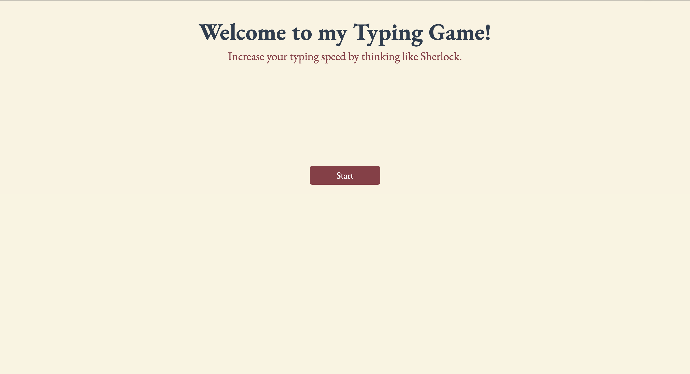
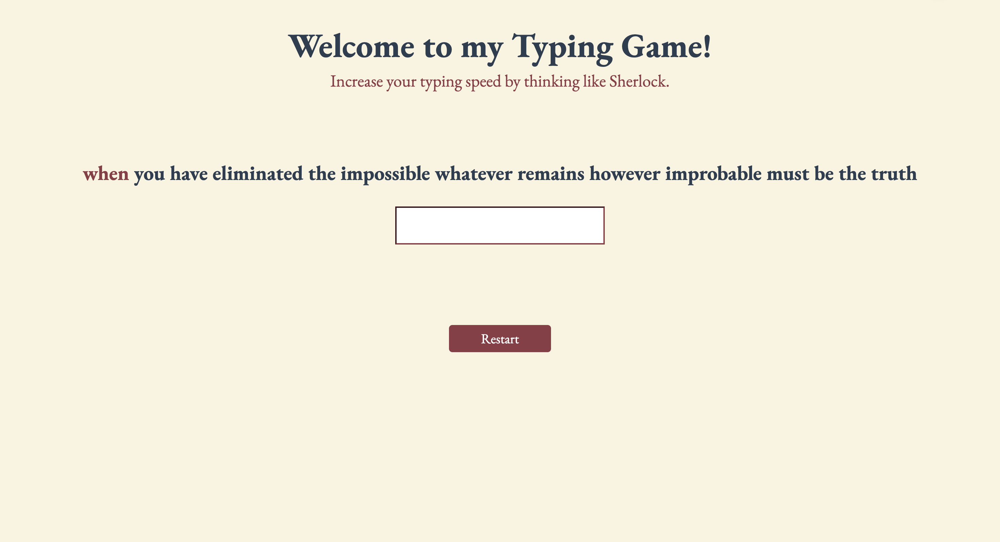
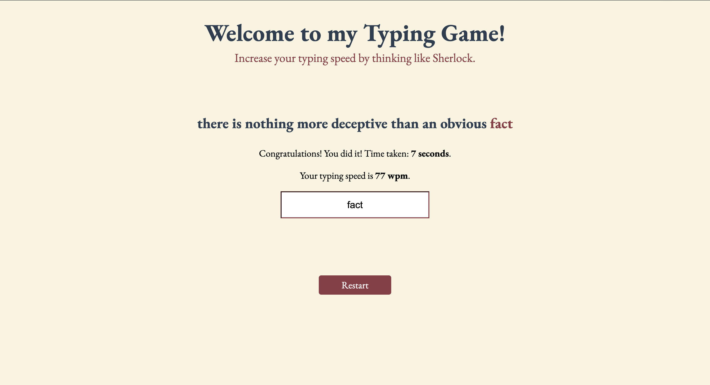

# Typing Game
Test your typing skills. This is a **MonkeyType esque** webapp where you can test your typing speed by typing quotes from Sherlock Holmes. It is built using HTML, CSS, and Vanilla JS.

# How It Works
When you hit the start button, it generates a random quote from Sherlock Holmes and a textbox appears for you to retype it. The current word is highlighted in a different color and if you type wrong, the textbox becomes red. After completion, the screen displays your typing speed and the time taken to complete.

# Images
### Home Screen

### After clicking Start

### UI for Typo

### Ending Screen
